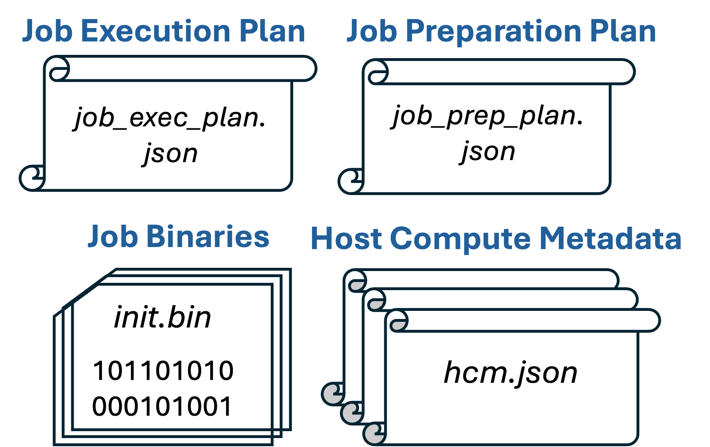

# SpyreCode Interface Specification

**Authors:**
* @ksarada
* @viji560
* @vswagath1989

## **Summary**
This document describes `SpyreCode` the artifacts produced by the Deeptools backend compiler for consumption by the torch-spyre device runtime to launch and execute a kernel (job) on Spyre.

## **Motivation**
`SpyreCode` is the contract between compiler and runtime to facilitate consumption of compilation artifacts for job launch during execution.

## **Proposed Implementation**

### Terminology and Background Notes:
The execution of a computation kernel on the Spyre device is referred to as a <u>job</u>. The <u>computation kernel</u>  comprises of sequence of operations, uses dynamic shapes with input/output tensors resident on host or device. Job execution on Spyre involves a combination of executing programs on Spyre cores (using a compute control block) and transfers between host &#8660; Spyre (using a DMA control block). Jobs executed on Spyre use a (maximum) 128GB virtual address space, split into 8 segments each having a maximum length of 16GB.

### Components of `SpyreCode`
`SpyreCode` facilitates the runtime to execute a job on Spyre. It comprises of 4 components:
* Job execution plan
* Job preparation plan
* Job Binaries (a.k.a. `init.bin`)
* Host Compute Metadata

<p align="center">
  
</p>
<p align="center">
  Figure 1. Components of `SpyreCode`
</p>  

In the virtual address space corresponding to a job, the last two segments (SegmentId=6 and SegmentId=7) are **reserved for use by `SpyreCode`**. This excludes both of them from being used for data tensors allocated by user-code (using .to() operation) or by compiler frontend (torch-inductor) generated code.

The two reserved segments are distinguished by how long what they hold has to live, and by whether the host reaches into it directly:

| Segment | Holds | Lifetime |
|---|---|---|
| SegmentId=7 (*static*) | Everything the host interacts with directly: the job binary, and the data needed to effect program correction | Outlives a single execution of the job; written by the host before the job runs |
| SegmentId=6 (*dynamic*) | Everything only the device looks at, e.g. intermediate data tensors the backend compiler allocates | No longer than one execution of the job |

The two are allocated separately (see the `Allocate` command below), and each is used from offset 0 of its own segment. Addresses the runtime is handed are always full virtual addresses, so the segment an allocation came from is implicit in the address itself.

The following sections detail the different components of `SpyreCode`.

### Artifacts on Disk

The compiler writes `SpyreCode` into a `spyreCodeDir` directory:

| File | Contents |
|---|---|
| `spyrecode.json` | The job execution and preparation plans. This is the artifact the runtime consumes. |
| `spyrecode_pretty.json` | The same content, indented for reading. Not consumed by the runtime. |
| `init_binary.bin` | The job binary named by an `InitTransfer` command. A job whose programs are transferred separately gets one file per transfer, named `init_binary_1.bin`, `init_binary_2.bin`, ... after the first. |

### JSON Encoding

Both plans live in one top-level JSON object, each an array of commands. A command is an object with a `command` name and a `properties` object holding that command's attributes:

```json
{
  "JobExecPlan" : [
    { "command" : "ComputeOnDevice",
      "properties" : { "job_bin_ptr" : "120259084288" } }
  ],
  "JobPreparationPlan" : [
    { "command" : "Allocate",
      "properties" : { "static_size" : "34816", "dynamic_size" : "16384" } },
    { "command" : "InitTransfer",
      "properties" : { "init_bin_file" : "init_binary.bin",
                       "size" : "32768",
                       "dev_ptr" : "120259084288" } }
  ]
}
```

Note that **every scalar attribute is encoded as a JSON string**, including sizes, addresses and booleans — the addresses and sizes exceed what a JSON number is guaranteed to carry exactly. Shapes are arrays of strings, and a shape attribute is omitted altogether rather than written as `[]` when it is empty. A reader that encounters a field it does not recognise must treat the plan as invalid rather than ignoring the field, so compiler and runtime have to agree on the attribute set exactly.

### Job Execution Plan

The job execution plan is a JSON object containing a list of commands (List\<JobExecPlanCommand\>). The runtime executes the commands in sequence to complete the execution of the job. Each command in the job plan is comprised of a command type and its associated attributes.

The command types in `JobPlanCommand` and their attributes are explained below:
* `ComputeOnHost`: Triggers execution of a predefined host function API. Its attributes are:
  * `ihandle`: A handle for the input tensor used as input to the host function. If the Job has runtime input arguments (e.g., a kernel with symbolic start addresses), then those input arguments are concatenated to form a meta tensor called `iargs`. The host function will use meta tensor as its input `ihandle=iargs`. NOTE: While the command attribute describes the tensor using a handle, the host function itself will take a pointer or reference to that tensor so as to process its contents during execution. NOTE: the compiler currently emits this attribute as an empty string, leaving the runtime to supply the `iargs` meta tensor it describes; `ishape` still carries that tensor's shape.
  * `ishape`: Shape of the tensor fed to `ihandle`
  * `ohandle`: A handle for the output tensor produced by the host function API. This output tensor could be transferred to the device or fed to another host function.
  * `oshape`: Shape of the tensor fed to `ohandle`
  * `size`: Size in bytes of the output tensor named by `ohandle`, i.e. the size of the buffer the host function is expected to return. A `DataTransfer` that sends that output to the device carries the same `size`.
  * `hcm`: A json object that contains metadata needed by the host function for its processing. This json object is produced by the backend compiler as part of `SpyreCode`
* `ComputeOnDevice`: Triggers execution of computation on Spyre Cores. This is achieved by runtime sending a control message to the card firmware which generates a compute control block (CB). Its attributes are:
  * `job_bin_ptr`: Starting virtual address of the job binary. The job binary is static, so this lies in SegmentId=7. Spyre requires start address to be a multiple of 128B.
* `DataTransfer`: Triggers a data transfer between host and Spyre. The runtime sends a control message to the card firmware to generate a DMAI or DMAO control block to effect the transfer. Its attributes are:
  * `dirn`: `"false"` indicates transfer to device and `"true"` indicates transfer from device
  * `host_handle`: A handle for the tensor on the host side.
  * `size`: Size of the data transfer (in Bytes)
  * `dev_ptr`: Starting virtual address where the tensor resides in the device. The transfers `SpyreCode` emits carry program-correction data, which is static, so this lies in SegmentId=7. Spyre requires start address to be a multiple of 128B.

### Job Preparation Plan

The job preparation plan is a JSON object containing a list of commands (List\<JobPrepPlanCommand\>). The runtime executes the commands in sequence as a preparation to running the actual job (as given by Job execution plan) on Spyre. The job preparation plan needs to be executed only once, and every subsequent invocation of the job does not need the preparation step. Each command in the job plan is comprised of a command type and its associated attributes.

* `Allocate`: Requests the runtime to allocate space on the device memory. Two allocations are requested, one per reserved segment, each starting from address 0 of its segment. The 3 uses of the space are: (a) to store the job binary (programs that will run on Spyre cores), (b) to store data needed to effect program correction supporting symbolic start address and tensor/compute shapes and (c) (if required) intermediate data tensors that are allocated in the device memory during backend compilation. Uses (a) and (b) are static and are allocated in SegmentId=7; use (c) is dynamic and is allocated in SegmentId=6.
  * `static_size`: Size of the allocation in SegmentId=7 (in Bytes)
  * `dynamic_size`: Size of the allocation in SegmentId=6 (in Bytes). Zero for a job that needs no device memory of its own beyond the tensors the frontend placed.

* `InitTransfer`: Triggers the transfer of the init (`init.bin`) from host to Spyre. 
  * `init_bin_file`: Name of the `init.bin` file, relative to the `spyreCodeDir` holding the plan.
  * `size`: Size of the init transfer (in Bytes)
  * `dev_ptr`: Starting virtual address where the init resides in the device. The init is static, so this lies in SegmentId=7. Spyre requires start address to be a multiple of 128B.

### Job Binaries a.k.a. `init.bin`

The `init.bin` is a set of binary files (not in text format) that contains the inits (programs for Spyre compute cores) needed to execute the kernel. The runtime transfers the job binaries from host to the Spyre device's memory as given by the `InitTransfer` command in the Job Preparation Plan.

### Host Compute metadata:

The host compute metadata is provided as an input to the `ComputeOnHost` job command. It contains information needed to process the input tensor produce an output tensor that can then be transferred to the device. An example of the use of host compute metadata in the context of kernel execution with symbolic start address and shapes is described in
[example](#example2-job-preparation-and-execution-plan-for-a-kernel-with-symbolic-tensor-addresses-and-shapes) below.

### Execution Flow Examples

The examples below are written in an abbreviated form, one command per line, rather than as the JSON of the [encoding](#json-encoding) section.

#### Example1: Job preparation and execution plan for a kernel with fixed tensor addresses and shapes

In this example, the compute kernel has tensors with fixed addresses and shapes. 

```
A) Job preparation plan
1. Allocate static_size=32768, dynamic_size=16384
2. InitTransfer init_bin_file=init_binary.bin, size=32768, dev_ptr=0x1C00000000

B) Job Execution plan
1. ComputeOnDevice job_bin_ptr=0x1C00000000
```

The job preparation plan in `SpyreCode` comprises of a sequence of 2 commands, `Allocate` and `InitTransfer`. The `Allocate` indicates the amount of memory that needs to be reserved in each of the two reserved segments. In this example, 32768 bytes are reserved in SegmentId=7 for the job binary, and 16384 bytes in SegmentId=6 for intermediate tensors the compiler placed in device memory. The `InitTransfer` command requests runtime to move the init binary present in file `init_binary.bin` of size 32768 into SegmentId=7 at offset 0 (virtual Address = 0x1C00000000).

The job execution plan comprises of a single `ComputeOnDevice` command. The `ComputeOnDevice` launches execution on Spyre with the job binary located at a virtual address of 0x1C00000000.


#### Example2: Job preparation and execution plan for a kernel with symbolic tensor addresses and shapes

This is a more complex example, wherein the compute kernel has tensors with symbolic start addresses and shapes. The symbol values are known only during kernel invocation and can change across consecutive launches of the same kernel. They are fed as input arguments when the kernel is invoked.

With symbolic tensor address/shapes, the job binary produced by the backend compiler cannot be executed as-is on the hardware. It needs to be edited just-in-time knowing the symbol values. This process is referred to as *program correction*. It is accomplished using the following job preparation and execution plans.

```
A) Job preparation plan
1. Allocate static_size=34816, dynamic_size=16384
2. InitTransfer init_bin_file=init_binary.bin, size=32768, dev_ptr=0x1C00000800

B) Job Execution plan
1. ComputeOnHost ihandle=iargs, ishape=[4], ohandle=T1, oshape=[16 128], size=2048, hcm=hcm.json
2. DataTransfer dirn=false host_handle=T1 size=2048 dev_ptr=0x1C00000000
3. ComputeOnDevice job_bin_ptr=0x1C00000800
```

The job preparation plan is comprised of 2 commands. 
* The first command is `Allocate`. 34816 bytes are requested in SegmentId=7: 32768 bytes for the job binary and an additional 2048 bytes for storing the data needed for program correction, both of which the host writes. A further 16384 bytes are requested in SegmentId=6 for the intermediate tensor data, which only the device reads.
* The second command `InitTransfer` moves the job binary to Spyre, past the 2048 bytes of correction data at the start of SegmentId=7. 

Next, the job execution plan comprises of 3 commands.
* The first command is to execute a host function `ComputeOnHost`, which takes the input arguments (4 in this case) and the host compute metadata (*hcm.json*) as its inputs, and produces a data tensor (T1) of 2048 bytes needed for program correction. The *hcm.json* contains information pertaining to how the input arguments (symbols) must be interpreted in the context of the job binary. For example, if a shape of a dimension in a tensor is symbolic during compilation, then its value (provided as part of input arguments) will be used to correct one of loop counts in the job binary.
* The second command transfers T1 to the device to a specific location indicated by the *dev_ptr*, which is in SegmentId=7 because the host produced it
* Finally, the last command executes the job binary. In this case, the job binary contains additional program instructions (which are executed on Spyre core) to first read T1 and make corrections to future program instructions. Then the corrected program instructions are executed (on Spyre cores), successfully completing the kernel execution with the desired tensor address/shape.
